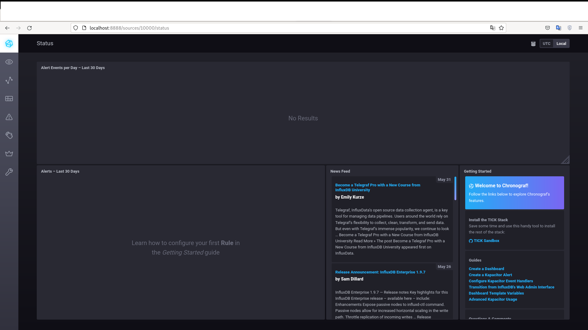
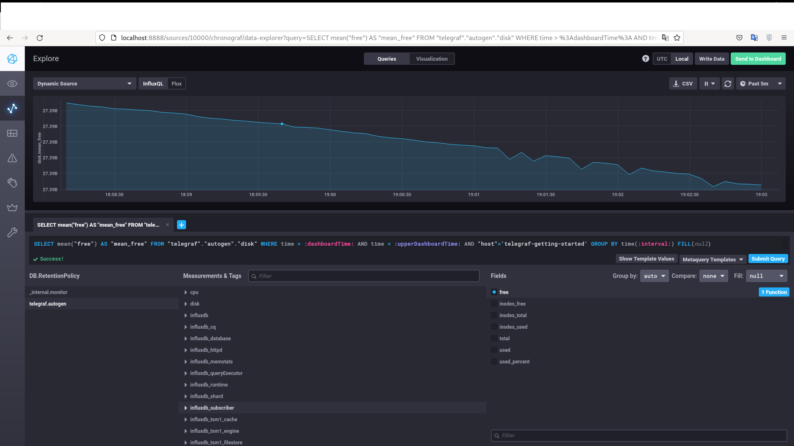
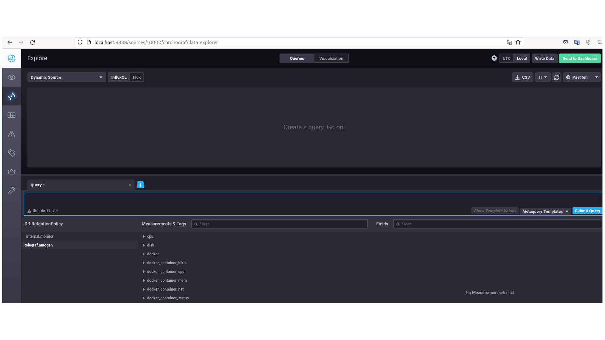

### Задание №1 
#### Плюсы и минусы тех что не было на лекции:

##### push:
- Плюсы:
  - хорошо подходит при динамической инфраструктуры
  - проще передать метрики в несколько систем

- Минусы:
  - необходима дополнительная конфигурация серверов (установка клиентов, настройка поддержки TLS)


##### pull:
- Плюсы:
  - возможность заранее просчитать объем получаемых данных
  - не нужны клиенты
  - контроль данных
  - легче производить поиск и устранение проблем

- Минусы:
  - при наличии нескольких серверов данные будут не одинаковые, к примеру временная метка будет различной.
  - потеря данных при недоступности клиента


### Задание №2

Система мониторинга | Модель       |
--------------------|--------------|
Prometheus          | PUSH & PULL  | 
TICK                | PUSH         | 
Zabbix              | PUSH & PULL  |
VictoriaMetrics     | PUSH & PULL  |
Nagios              |    PUSH      |


### Задание №3
#### Вывод команд:
```
vlad@home:~/Documents/Netology/DevOps/dz_№46/sandbox$ curl http://localhost:8086/ping
vlad@home:~/Documents/Netology/DevOps/dz_№46/sandbox$ curl http://localhost:8888
<!DOCTYPE html><html><head><meta http-equiv="Content-type" content="text/html; charset=utf-8"><title>Chronograf</title><link rel="icon shortcut" href="/favicon.fa749080.ico"><link rel="stylesheet" href="/src.9cea3e4e.css"></head><body> <div id="react-root" data-basepath=""></div> <script src="/src.a969287c.js"></script> </body></html> 
vlad@home:~/Documents/Netology/DevOps/dz_№46/sandbox$ curl http://localhost:9092/kapacitor/v1/ping
```
#### Скриншот ПО chronograf: 


### Задание №4
#### Метрика утилизации места на диске:
 


### Задание №5
#### Список метрик докера:
 
